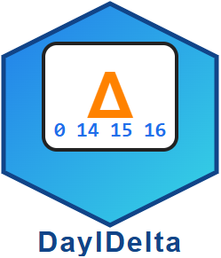

<div align="center">
  
</div>

# DayIDelta  
Production-grade SCD2 management for time series data in Delta Lake across Spark platforms (Microsoft Fabric, Azure Databricks Unity Catalog, Synapse, generic Spark 3.x) — with an AI assistant for instant point-in-time and comparison queries.

[License](LICENSE) • [Contributing](CONTRIBUTING.md) • [Architecture](docs/architecture.md) • [Unity Catalog Guide](docs/unity_catalog.md) • [Chatbot](docs/chatbot.md) • [Performance & Design](docs/performance_design.md) • [FAQ](docs/faq.md)

## Badges (Add Once Available)
    

## Elevator Pitch
DayIDelta is a lightweight, deterministic alternative to ad‑hoc MERGE-based SCD2 implementations. It focuses on event-based time series observation tables, providing clean start/end lineage keyed by a surrogate batch day dimension—ensuring reproducibility, multi-source safety, and simplified queryability. Its integrated AI chatbot accelerates analytics by generating point-in-time, current, historical, and comparison SQL + PySpark code directly from natural language.

## Why DayIDelta vs Alternatives?
| Dimension | Typical MERGE Pattern | Generic SCD2 Frameworks | DayIDelta |
|-----------|-----------------------|--------------------------|-----------|
| Event-time disorder handling | Prone to race/order issues | Mixed | Surrogate batch `day_id` decoupled from event-time |
| Multi-source selective expiration | Often expires everything | Varies | Source-aware expiration (only sources present in batch) |
| Column footprint | Extra audit clutter | Often heavy | Keys + tracked + start_day_id/end_day_id only |
| Determinism / Idempotency | Depends on MERGE semantics | Varies | Explicit insert/close logic keyed by batch day |
| Cross-platform Spark portability | Platform-tuned | Sometimes | Fabric, Unity Catalog, Synapse, generic Spark 3.x |
| Query acceleration | Manual SQL each time | Limited | Built-in AI chatbot (SQL + PySpark generation) |
| Complexity | Hidden edge cases | Medium | Lean, inspectable SQL logic |
| Extensibility | Hard to refactor | Framework-bound | Modular + pluggable helper functions |

## Core Concepts
- dim_day: Surrogate key table guaranteeing monotonically increasing `day_id`.
- start_day_id / end_day_id: Batch lineage window (0 or null/0 style sentinel for “open”).
- Tracked columns: Only changes in these close/open versions.
- Source-aware expiration: Only expire what you actually processed in that batch.

## Quickstart (Not Yet on PyPI)
Clone and install in editable mode:
```bash
git clone https://github.com/botlhale/DayIDelta.git
cd DayIDelta
pip install -e ".[dev]"
```

Minimal usage:
```python
from pyspark.sql import SparkSession
# Use the modern modular import structure
from dayidelta import DayIDelta, setup_unity_catalog_environment
from datetime import datetime

spark = SparkSession.builder.getOrCreate()

# Setup Unity Catalog environment
setup_unity_catalog_environment(spark, "my_catalog", "time_series_schema")

batch1 = spark.createDataFrame([
    ("TS1", datetime(2025, 6, 23, 0, 0), "SRC1", 1.11),
    ("TS2", datetime(2025, 6, 23, 4, 0), "SRC1", 2.22),
], ["TIME_SERIES_NAME", "DATETIME", "DATA_SOURCE", "VALUE"])

DayIDelta(
    new_data_df=batch1,
    key_cols=["TIME_SERIES_NAME", "DATETIME", "DATA_SOURCE"],
    tracked_cols=["VALUE"],
    dest_sch="dbo",
    dest_tb_obs="dayidelta_obs"
)

spark.table("dbo.dayidelta_obs").show()
```

Unity Catalog example (see: docs/unity_catalog.md):
```python
from pyspark.sql import SparkSession
from dayidelta import DayIDelta, setup_unity_catalog_environment

spark = (SparkSession.builder
         .appName("DayIDelta UC")
         .config("spark.sql.extensions","io.delta.sql.DeltaSparkSessionExtension")
         .config("spark.sql.catalog.spark_catalog","org.apache.spark.sql.delta.catalog.DeltaCatalog")
         .getOrCreate())

setup_unity_catalog_environment(spark, "my_catalog", "time_series")
```

## AI Chatbot Highlight 🤖
Accelerate analytics with natural language:
```python
from dayidelta.agents.chatbot import SCD2Chatbot  
from dayidelta.core.models import TableSchema

schema = TableSchema(
    catalog="my_catalog",
    schema="time_series",
    table="sensor_readings",
    key_columns=["sensor_id", "timestamp", "location"],
    tracked_columns=["temperature", "status"]
)

chatbot = SCD2Chatbot()
resp = chatbot.chat("compare current data with data 7 days ago", schema)
print(resp.sql_query)
print(resp.python_code)
```
More patterns: [Chatbot Docs](docs/chatbot.md)

## Install / Packaging Notes
Not on PyPI yet. Structure already PyPI-ready (pyproject.toml). When ready to publish:
```bash
python -m build
twine upload dist/*
```

## Performance & Design Rationale (Summary)
- Deterministic Insert/Close: Avoids schema merge anomalies.
- Batch Surrogate Day Key: Shields lineage from late/out-of-order event timestamps.
- Source-aware Expiration: Minimizes false closures.
- Minimal Schema: Reduces storage + index complexity.
Full details: [Performance & Design](docs/performance_design.md)

## Typical Queries
Current:
```sql
SELECT * FROM schema.dayidelta_obs WHERE end_day_id = 0;
```
Point-in-time:
```sql
SELECT * FROM schema.dayidelta_obs
WHERE start_day_id <= :asof AND (end_day_id = 0 OR end_day_id > :asof);
```
Comparison templates & more: see chatbot / docs.

## Best Practices
- One DayIDelta call per logical batch.
- Keep tracked_cols tight.
- Do not include raw `day_id` in incoming data.
- Use tests (tests/ folder) to validate multi-source logic.

## Project Roadmap (Aspirational)
- Publish to PyPI
- Streaming micro-batch variant
- Optional point-in-time query helpers API
- Additional chatbot time grammar & optimization suggestions

## Contributing
See [CONTRIBUTING.md](CONTRIBUTING.md) for environment setup, style, testing, and PR flow.

## License
MIT © 13668754 Canada Inc (see [LICENSE](LICENSE))

## FAQ
Extended: [FAQ](docs/faq.md)

## SEO / Discoverability Keywords
Delta Lake SCD2, Slowly Changing Dimension Type 2, time series dimension management, point-in-time queries, batch surrogate key, Azure Databricks Unity Catalog SCD2, Microsoft Fabric SCD2, Spark SCD2 history, historical lineage analytics.

---
